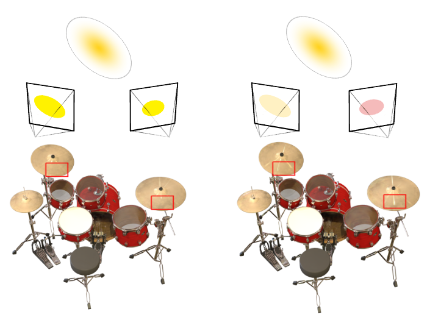

# Gaussian Splatting with NeRF-based Color and Opacity
Dawid Malarz*, Weronika Smolak*, Jacek Tabor, Sławomir Tadeja, Przemysław Spurek (* indicates equal contribution) 

| arXiv |
| :---- |
| [Gaussian Splatting with NeRF-based Color and Opacity](https://arxiv.org/pdf/2312.13729.pdf)|

Abstract: *Neural Radiance Fields (NeRFs) have demonstrated the remarkable potential of neural networks to capture the intricacies of 3D objects. By encoding the shape and color information within neural network weights, NeRFs excel at producing strikingly sharp novel views of 3D objects. Recently, numerous generalizations of NeRFs utilizing generative models have emerged, expanding its versatility. In contrast, Gaussian Splatting (GS) offers a similar renders quality with faster training and inference as it does not need neural networks to work. We encode information about the 3D objects in the set of Gaussian distributions that can be rendered in 3D similarly to classical meshes. Unfortunately, GS are difficult to condition since they usually require circa hundred thousand Gaussian components. To mitigate the caveats of both models, we propose a hybrid model that uses GS representation of the 3D object's shape and NeRF-based encoding of color and opacity. Our model uses Gaussian distributions with trainable positions (i.e. means of Gaussian), shape (i.e. covariance of Gaussian), color and opacity, and neural network, which takes parameters of Gaussian and viewing direction to produce changes in color and opacity. Consequently, our model better describes shadows, light reflections, and transparency of 3D objects.*

## 3D Gaussian Splatting
Code is a modification of the original code from [3D Gaussian Splatting for Real-Time Radiance Field Rendering paper](https://repo-sam.inria.fr/fungraph/3d-gaussian-splatting/).

## Requirements

- Dependencies for Conda environment management are stored in `environment.yml`

## Notes

Current version of the code in this repository shows our best performing model which creates opacity factors which are then multiplied by original opacity and used further in gaussians training process. In the future other versions of models (i.e. SHS factor multiplication) used in the paper may be added to this repository.  

Interactive viewers such as SIBR viewers are not currently supported by our code and may be rendered incorrectly by them.

